# KIẾN TRÚC XỬ LÝ VIDEO AIC

## 1. Phạm vi bắt buộc

Pipeline chỉ gồm các thành phần sau:

```text
Video MP4
→ AutoShot
→ Shot.json
→ Index N frame từ video
→ Chia batch 10 frame
→ Xử lý giảm frame tương đồng
→ Frame.json
→ Mapping từ Video MP4 + Frame.json
→ Ảnh frame PNG
→ FGCLIP embedding
→ Vector NPY
→ Tính vector similarity với Step = 2
→ Cập nhật kết quả vào Frame.json
```

Không sử dụng các thành phần ngoài luồng trên như:

```text
run_id
run manifest
log manifest
mapping.json
similarity.json
final_selection.json
Vector Database bên ngoài
Qdrant
Milvus
Weaviate
cơ chế resume riêng
cơ chế cleanup riêng
```

---

## 2. Nguyên tắc bắt buộc về định danh

### 2.1. Bảo toàn `video_id`

Tên video không có phần mở rộng được dùng làm `video_id`.

```text
L21_V01.mp4
→ video_id = L21_V01
```

`video_id` phải được giữ nguyên trong toàn bộ pipeline.

#### 2.1.1. Quy ước cấu trúc tên `Lxx_Vxx`

`video_id` sử dụng định dạng:

```text
Lxx_Vxx
```

Trong đó:

```text
Lxx = mã nhóm hoặc đơn vị cấp cha chứa video
Vxx = số thứ tự của video trong nhóm đó
```

Ví dụ:

```text
L02_V01
```

được hiểu là:

```text
Nhóm L02
└── Video số 01
```

Các thành phần được tách như sau:

```text
group_id       = L02
video_sequence = V01
video_id       = L02_V01
```

Quy tắc bắt buộc:

- `V01` có nghĩa là video số `01`.
- `L02` là mã nhóm hoặc đơn vị cấp cha số `02`.
- Chữ `L` chỉ là tiền tố định danh nhóm theo quy ước đặt tên đầu vào.
- Kiến trúc này không tự gán thêm ý nghĩa nghiệp vụ khác cho chữ `L`.
- Không được đổi `L02_V01` thành tên hoặc số thứ tự mới trong các bước xử lý.
- Tên thư mục frame và vector phải sử dụng nguyên vẹn `video_id`.

Ví dụ bảo toàn tên:

```text
Video:
data/videos/L02_V01.mp4

Frame:
data/frames/L02_V01/00000125.png

Vector:
data/vectors/L02_V01/00000125.npy
```

Quan hệ bắt buộc:

```text
basename video không có phần mở rộng
=
tên thư mục frame
=
tên thư mục vector
=
Frame.json.video_id
```

### 2.2. Bảo toàn `frame_id`

Sau khi một frame được gán `frame_id`, giá trị này không được thay đổi ở bất kỳ bước nào.

```text
Frame.json: frame_id = 00000125
Ảnh PNG:    00000125.png
Vector NPY: 00000125.npy
```

Quan hệ bắt buộc:

```text
Frame.json.frame_id
=
basename của file PNG
=
basename của file NPY
```

Ví dụ đúng:

```text
frames/L21_V01/00000125.png
vectors/L21_V01/00000125.npy
```

Ví dụ sai:

```text
frames/L21_V01/00000125.png
vectors/L21_V01/01.npy
```

### 2.3. Batch không được đổi tên frame

`batch_size = 10` chỉ dùng để chia nhóm xử lý.

Batch không được:

- Đánh lại số thứ tự frame.
- Dùng vị trí trong batch làm tên file.
- Thay đổi `video_id`.
- Thay đổi `frame_id`.

Ví dụ một batch:

```text
00000101
00000102
00000103
00000104
00000105
00000106
00000107
00000108
00000109
00000110
```

Sau khi xử lý trùng chỉ còn:

```text
00000101
00000104
00000109
```

Tên đầu ra vẫn phải là:

```text
00000101.png → 00000101.npy
00000104.png → 00000104.npy
00000109.png → 00000109.npy
```

Không được đổi thành:

```text
01.png → 01.npy
02.png → 02.npy
03.png → 03.npy
```

---

## 3. Sơ đồ kiến trúc tổng thể

```mermaid
flowchart LR
    V["Video MP4"] --> A["AutoShot"]
    A --> S["Shot.json<br/>frame_start, frame_end"]

    V --> I["Index N frame từ video"]
    S --> I

    I --> B["Batch 10 frame"]
    B --> D["Xử lý giảm frame tương đồng"]
    D --> F["Frame.json"]

    V --> M["Mapping"]
    F --> M

    M --> P["Ảnh PNG<br/>frames/video_id/frame_id.png"]
    P --> E["Embedding bằng FGCLIP"]
    E --> N["Vector NPY<br/>vectors/video_id/frame_id.npy"]

    N --> C["Cosine similarity<br/>Step = 2"]
    C --> Q{"> 0.4?"}
    Q -->|Có| R1["Giữ i+1"]
    Q -->|Không| R2["Giữ i và i+1"]

    R1 --> U["Cập nhật Frame.json"]
    R2 --> U
```



---

## 4. Cấu trúc thư mục bắt buộc

```text
data/
├── videos/
│   ├── L21_V01.mp4
│   └── L22_V02.mp4
│
├── metadata/
│   ├── L21_V01/
│   │   ├── Shot.json
│   │   └── Frame.json
│   └── L22_V02/
│       ├── Shot.json
│       └── Frame.json
│
├── frames/
│   ├── L21_V01/
│   │   ├── 00000125.png
│   │   ├── 00000140.png
│   │   └── 00000155.png
│   └── L22_V02/
│       ├── 00000075.png
│       └── 00000090.png
│
└── vectors/
    ├── L21_V01/
    │   ├── 00000125.npy
    │   ├── 00000140.npy
    │   └── 00000155.npy
    └── L22_V02/
        ├── 00000075.npy
        └── 00000090.npy
```

Quy tắc mirror bắt buộc:

```text
data/frames/<video_id>/<frame_id>.png
data/vectors/<video_id>/<frame_id>.npy
```

---

## 5. Giai đoạn 1 — Nhận Video MP4

### Đầu vào

```text
data/videos/<video_id>.mp4
```

Ví dụ:

```text
data/videos/L21_V01.mp4
```

### Đầu ra

Video gốc được truyền đến:

1. AutoShot.
2. Khối Index N frame.
3. Mapping.

Video không bị đổi tên trong quá trình xử lý.

---

## 6. Giai đoạn 2 — AutoShot và `Shot.json`

### 6.1. Chức năng

AutoShot đọc video MP4 và xác định các đoạn shot.

Mỗi shot phải có:

```text
frame_start
frame_end
```

### 6.2. Đường dẫn đầu ra

```text
data/metadata/<video_id>/Shot.json
```

### 6.3. Cấu trúc `Shot.json`

```json
{
  "video_id": "L21_V01",
  "shots": [
    {
      "shot_id": "shot_000001",
      "frame_start": 0,
      "frame_end": 124
    },
    {
      "shot_id": "shot_000002",
      "frame_start": 125,
      "frame_end": 310
    }
  ]
}
```

### 6.4. Điều kiện hợp lệ

```text
frame_start >= 0
frame_end >= frame_start
```

Các shot phải được sắp xếp theo `frame_start` tăng dần.

---

## 7. Giai đoạn 3 — Index N frame từ video

### 7.1. Đầu vào

```text
Video MP4
Shot.json
Số lượng N frame cần lấy
```

### 7.2. Chức năng

Khối này xác định danh sách frame ứng viên từ video dựa trên các khoảng trong `Shot.json`.

Mỗi frame ứng viên phải có tối thiểu:

```text
video_id
frame_id
frame_index
timestamp_ms
shot_id
```

### 7.3. Quy tắc tạo `frame_id`

Nếu nguồn đã cung cấp `frame_id`, phải giữ nguyên giá trị đó.

Nếu phải tạo mới, dùng `frame_index` được zero-pad để thứ tự tên file trùng với thứ tự frame.

```text
frame_index = 125
frame_id = 00000125
```

Quy tắc đề xuất:

```python
frame_id = f"{frame_index:08d}"
```

Sau khi tạo, `frame_id` trở thành bất biến.

---

## 8. Giai đoạn 4 — Chia batch 10 frame

Danh sách frame ứng viên được sắp xếp theo `frame_index` tăng dần rồi chia thành các batch tối đa 10 frame.

```text
Batch 1: frame 1  → frame 10
Batch 2: frame 11 → frame 20
...
```

Batch cuối có thể chứa ít hơn 10 frame.

Dữ liệu batch chỉ cần giữ tham chiếu đến frame gốc:

```python
batch = [
    frame_00000101,
    frame_00000102,
    ...,
    frame_00000110,
]
```

Không tạo ID mới thay thế `frame_id`.

---

## 9. Giai đoạn 5 — Xử lý giảm frame tương đồng

### 9.1. Đầu vào

```text
Batch tối đa 10 frame
Các frame ứng viên lấy từ video
```

### 9.2. Đầu ra bắt buộc

Khối xử lý phải trả về danh sách frame được giữ lại.

```python
kept_frame_ids: list[str]
```

Nếu cần ghi nhận frame bị loại, chỉ dùng `frame_id` gốc:

```python
duplicate_to_representative: dict[str, str]
```

Ví dụ:

```python
kept_frame_ids = [
    "00000101",
    "00000104",
    "00000109",
]

duplicate_to_representative = {
    "00000102": "00000101",
    "00000103": "00000101",
    "00000105": "00000104"
}
```

### 9.3. Ràng buộc

- Không đổi `frame_id`.
- Không đánh lại số sau khi loại trùng.
- Không dùng vị trí trong batch làm tên frame.
- Kết quả phải được sắp xếp lại theo `frame_index` tăng dần.

Thuật toán nội bộ dùng để giảm frame tương đồng không được mô tả trong sơ đồ, vì vậy module này chỉ bắt buộc tuân theo hợp đồng đầu vào và đầu ra ở trên.

---

## 10. Giai đoạn 6 — Tạo `Frame.json`

### 10.1. Đường dẫn

```text
data/metadata/<video_id>/Frame.json
```

### 10.2. Vai trò

`Frame.json` là file metadata duy nhất dùng để:

- Chỉ định frame nào cần Mapping trích xuất.
- Liên kết frame với file PNG.
- Liên kết frame với file vector NPY.
- Lưu kết quả similarity cuối.

### 10.3. Cấu trúc bắt buộc

```json
{
  "video_id": "L21_V01",
  "source_video_path": "data/videos/L21_V01.mp4",
  "batch_size": 10,
  "frames": [
    {
      "frame_id": "00000125",
      "frame_index": 125,
      "timestamp_ms": 5000,
      "shot_id": "shot_000002",
      "preliminary_status": "KEPT",
      "frame_path": null,
      "vector_path": null,
      "final_status": "PENDING",
      "representative_frame_id": null,
      "similarity_score": null
    }
  ]
}
```

### 10.4. Giá trị trạng thái

`preliminary_status`:

```text
KEPT
DUPLICATE
```

`final_status`:

```text
PENDING
KEPT
DUPLICATE
```

Chỉ các record có:

```text
preliminary_status = KEPT
```

mới được Mapping trích xuất thành ảnh PNG.

---

## 11. Giai đoạn 7 — Mapping

### 11.1. Hai đầu vào bắt buộc

```text
1. Video MP4 gốc
2. Frame.json
```

### 11.2. Chức năng

Với từng record có `preliminary_status = KEPT`, Mapping phải:

1. Đọc `frame_index` hoặc `timestamp_ms` từ `Frame.json`.
2. Truy xuất đúng frame trong video gốc.
3. Lưu frame thành file PNG.
4. Dùng nguyên `frame_id` làm tên file.
5. Ghi đường dẫn PNG trở lại record tương ứng trong `Frame.json`.

### 11.3. Đường dẫn đầu ra

```text
data/frames/<video_id>/<frame_id>.png
```

Ví dụ:

```text
data/frames/L21_V01/00000125.png
```

### 11.4. Cập nhật `Frame.json`

Trước Mapping:

```json
{
  "frame_id": "00000125",
  "frame_path": null
}
```

Sau Mapping:

```json
{
  "frame_id": "00000125",
  "frame_path": "data/frames/L21_V01/00000125.png"
}
```

### 11.5. Validation bắt buộc

```text
Path file phải tồn tại.
Extension phải là .png.
Tên file không có extension phải bằng frame_id.
Tên thư mục cha phải bằng video_id.
```

---

## 12. Giai đoạn 8 — Embedding bằng FGCLIP

### 12.1. Đầu vào

FGCLIP đọc các ảnh PNG được liệt kê trong `Frame.json`.

```text
data/frames/L21_V01/00000125.png
```

### 12.2. Xử lý batch

Ảnh có thể được đưa vào FGCLIP theo batch 10 để tối ưu xử lý.

Batch embedding không được thay đổi thứ tự ánh xạ và không được đổi tên frame.

### 12.3. Đầu ra

Mỗi ảnh PNG tạo ra đúng một vector embedding.

```text
00000125.png
→ FGCLIP
→ 00000125.npy
```

Vector phải là mảng một chiều:

```text
shape = [D]
```

Trong đó `D` là số chiều đầu ra thực tế của FGCLIP.

### 12.4. Đường dẫn vector

```text
data/vectors/<video_id>/<frame_id>.npy
```

Ví dụ:

```text
data/vectors/L21_V01/00000125.npy
```

### 12.5. Cập nhật `Frame.json`

Trước embedding:

```json
{
  "frame_id": "00000125",
  "frame_path": "data/frames/L21_V01/00000125.png",
  "vector_path": null
}
```

Sau embedding:

```json
{
  "frame_id": "00000125",
  "frame_path": "data/frames/L21_V01/00000125.png",
  "vector_path": "data/vectors/L21_V01/00000125.npy"
}
```

### 12.6. Validation bắt buộc

```text
Vector phải load được bằng NumPy.
Vector phải là mảng một chiều.
Vector không được chứa NaN.
Vector không được chứa Infinity.
Vector không được là zero vector.
Tên file NPY phải bằng frame_id.
Thư mục cha phải bằng video_id.
```

---

## 13. Giai đoạn 9 — Tính vector similarity

### 13.1. Đầu vào

Chỉ lấy các frame thỏa mãn:

```text
preliminary_status = KEPT
vector_path khác null
```

Danh sách frame phải được sắp xếp theo:

```text
frame_index tăng dần
```

### 13.2. Chuẩn hóa vector

Trước khi tính similarity, mỗi vector được chuẩn hóa L2:

```python
vector = vector / np.linalg.norm(vector)
```

### 13.3. Cosine similarity

```python
similarity = float(np.dot(vector_i, vector_i_plus_1))
```

Vì hai vector đã được chuẩn hóa L2, dot product chính là cosine similarity.

### 13.4. Quy tắc `Step = 2`

Các vector được ghép thành từng cặp không chồng lấn:

```text
frame[0] với frame[1]
frame[2] với frame[3]
frame[4] với frame[5]
...
```

Pseudocode:

```python
for i in range(0, len(frames), 2):
    left = frames[i]
    right = frames[i + 1] if i + 1 < len(frames) else None
```

Không xử lý theo cửa sổ trượt:

```text
Không dùng:
frame[0] với frame[1]
frame[1] với frame[2]
frame[2] với frame[3]
```

### 13.5. Quy tắc quyết định

#### Trường hợp `similarity > 0.4`

```text
Giữ frame i+1.
Đánh dấu frame i là DUPLICATE.
frame i tham chiếu đến frame i+1.
```

Ví dụ:

```text
00000125.npy ↔ 00000140.npy
similarity = 0.7123

00000125 → DUPLICATE
00000140 → KEPT
00000125.representative_frame_id = 00000140
```

#### Trường hợp `similarity <= 0.4`

```text
Giữ cả frame i và frame i+1.
```

Ví dụ:

```text
00000155.npy ↔ 00000170.npy
similarity = 0.2311

00000155 → KEPT
00000170 → KEPT
```

Giá trị đúng bằng `0.4` được xử lý theo nhánh giữ cả hai để không tạo trường hợp không có quyết định.

#### Trường hợp frame cuối bị lẻ

Nếu danh sách còn một frame cuối không có `i+1`:

```text
Giữ frame cuối.
```

### 13.6. Không đổi tên hoặc di chuyển file

Bước similarity chỉ tạo quyết định và cập nhật `Frame.json`.

Không được:

```text
Đổi tên PNG.
Đổi tên NPY.
Đánh lại số frame.
Di chuyển frame sang thư mục mới.
```

---

## 14. Giai đoạn 10 — Cập nhật kết quả

Kết quả similarity được cập nhật trực tiếp vào các record trong `Frame.json`.

Không tạo file kết quả bổ sung.

### 14.1. Frame được giữ

```json
{
  "frame_id": "00000140",
  "final_status": "KEPT",
  "representative_frame_id": null,
  "similarity_score": 0.7123
}
```

### 14.2. Frame bị xem là trùng

```json
{
  "frame_id": "00000125",
  "final_status": "DUPLICATE",
  "representative_frame_id": "00000140",
  "similarity_score": 0.7123
}
```

### 14.3. Khi giữ cả hai

```json
{
  "frame_id": "00000155",
  "final_status": "KEPT",
  "representative_frame_id": null,
  "similarity_score": 0.2311
}
```

```json
{
  "frame_id": "00000170",
  "final_status": "KEPT",
  "representative_frame_id": null,
  "similarity_score": 0.2311
}
```

### 14.4. Frame cuối bị lẻ

```json
{
  "frame_id": "00000185",
  "final_status": "KEPT",
  "representative_frame_id": null,
  "similarity_score": null
}
```

Các bước downstream chỉ sử dụng record có:

```text
final_status = KEPT
```

---

## 15. Ví dụ `Frame.json` hoàn chỉnh sau xử lý

```json
{
  "video_id": "L21_V01",
  "source_video_path": "data/videos/L21_V01.mp4",
  "batch_size": 10,
  "frames": [
    {
      "frame_id": "00000125",
      "frame_index": 125,
      "timestamp_ms": 5000,
      "shot_id": "shot_000002",
      "preliminary_status": "KEPT",
      "frame_path": "data/frames/L21_V01/00000125.png",
      "vector_path": "data/vectors/L21_V01/00000125.npy",
      "final_status": "DUPLICATE",
      "representative_frame_id": "00000140",
      "similarity_score": 0.7123
    },
    {
      "frame_id": "00000140",
      "frame_index": 140,
      "timestamp_ms": 5600,
      "shot_id": "shot_000002",
      "preliminary_status": "KEPT",
      "frame_path": "data/frames/L21_V01/00000140.png",
      "vector_path": "data/vectors/L21_V01/00000140.npy",
      "final_status": "KEPT",
      "representative_frame_id": null,
      "similarity_score": 0.7123
    },
    {
      "frame_id": "00000155",
      "frame_index": 155,
      "timestamp_ms": 6200,
      "shot_id": "shot_000002",
      "preliminary_status": "KEPT",
      "frame_path": "data/frames/L21_V01/00000155.png",
      "vector_path": "data/vectors/L21_V01/00000155.npy",
      "final_status": "KEPT",
      "representative_frame_id": null,
      "similarity_score": 0.2311
    },
    {
      "frame_id": "00000170",
      "frame_index": 170,
      "timestamp_ms": 6800,
      "shot_id": "shot_000002",
      "preliminary_status": "KEPT",
      "frame_path": "data/frames/L21_V01/00000170.png",
      "vector_path": "data/vectors/L21_V01/00000170.npy",
      "final_status": "KEPT",
      "representative_frame_id": null,
      "similarity_score": 0.2311
    }
  ]
}
```

---

## 16. Logic similarity bắt buộc

```python
from dataclasses import dataclass
from pathlib import Path
import numpy as np


@dataclass
class FrameRecord:
    frame_id: str
    frame_index: int
    vector_path: str
    final_status: str = "PENDING"
    representative_frame_id: str | None = None
    similarity_score: float | None = None


def load_normalized_vector(path: str) -> np.ndarray:
    vector = np.load(Path(path))

    if vector.ndim != 1:
        raise ValueError(f"Vector must be one-dimensional: {path}")

    if not np.isfinite(vector).all():
        raise ValueError(f"Vector contains NaN or Infinity: {path}")

    norm = np.linalg.norm(vector)
    if norm == 0:
        raise ValueError(f"Zero vector is invalid: {path}")

    return vector / norm


def process_similarity(
    frames: list[FrameRecord],
    threshold: float = 0.4,
) -> list[FrameRecord]:
    ordered = sorted(frames, key=lambda item: item.frame_index)

    for i in range(0, len(ordered), 2):
        left = ordered[i]

        if i + 1 >= len(ordered):
            left.final_status = "KEPT"
            left.representative_frame_id = None
            left.similarity_score = None
            continue

        right = ordered[i + 1]

        left_vector = load_normalized_vector(left.vector_path)
        right_vector = load_normalized_vector(right.vector_path)

        if left_vector.shape != right_vector.shape:
            raise ValueError(
                f"Vector dimensions do not match: "
                f"{left.frame_id} and {right.frame_id}"
            )

        score = float(np.dot(left_vector, right_vector))

        if score > threshold:
            left.final_status = "DUPLICATE"
            left.representative_frame_id = right.frame_id
            left.similarity_score = score

            right.final_status = "KEPT"
            right.representative_frame_id = None
            right.similarity_score = score
        else:
            left.final_status = "KEPT"
            left.representative_frame_id = None
            left.similarity_score = score

            right.final_status = "KEPT"
            right.representative_frame_id = None
            right.similarity_score = score

    return ordered
```

---

## 17. Cấu trúc source code tối thiểu

```text
aic_pipeline/
├── main.py
├── autoshot.py
├── frame_indexer.py
├── frame_dedup.py
├── frame_json.py
├── mapping.py
├── fgclip_embedding.py
└── similarity.py
```

### 17.1. `autoshot.py`

```python
def create_shot_json(video_path: str, output_path: str) -> None:
    """Đọc video, phát hiện shot và ghi Shot.json."""
```

### 17.2. `frame_indexer.py`

```python
def index_frames(
    video_path: str,
    shot_json_path: str,
    number_of_frames: int,
) -> list[dict]:
    """Tạo danh sách N frame và gán frame_id bất biến."""
```

### 17.3. `frame_dedup.py`

```python
def reduce_similar_frames(
    video_path: str,
    frame_candidates: list[dict],
    batch_size: int = 10,
) -> list[dict]:
    """Giảm frame tương đồng và giữ nguyên frame_id."""
```

### 17.4. `frame_json.py`

```python
def save_frame_json(
    video_id: str,
    video_path: str,
    frames: list[dict],
    output_path: str,
) -> None:
    """Tạo hoặc cập nhật Frame.json."""
```

### 17.5. `mapping.py`

```python
def extract_png_frames(
    video_path: str,
    frame_json_path: str,
    frames_root: str,
) -> None:
    """Đọc Video MP4 + Frame.json và lưu PNG theo frame_id."""
```

### 17.6. `fgclip_embedding.py`

```python
def embed_frames(
    frame_json_path: str,
    vectors_root: str,
    batch_size: int = 10,
) -> None:
    """Embedding PNG bằng FGCLIP và lưu NPY cùng frame_id."""
```

### 17.7. `similarity.py`

```python
def update_similarity_results(
    frame_json_path: str,
    threshold: float = 0.4,
    step: int = 2,
) -> None:
    """Tính similarity và cập nhật trực tiếp Frame.json."""
```

### 17.8. `main.py`

```python
def run_pipeline(video_path: str, number_of_frames: int) -> None:
    video_id = get_video_id(video_path)

    shot_json_path = f"data/metadata/{video_id}/Shot.json"
    frame_json_path = f"data/metadata/{video_id}/Frame.json"

    create_shot_json(
        video_path=video_path,
        output_path=shot_json_path,
    )

    candidates = index_frames(
        video_path=video_path,
        shot_json_path=shot_json_path,
        number_of_frames=number_of_frames,
    )

    kept_frames = reduce_similar_frames(
        video_path=video_path,
        frame_candidates=candidates,
        batch_size=10,
    )

    save_frame_json(
        video_id=video_id,
        video_path=video_path,
        frames=kept_frames,
        output_path=frame_json_path,
    )

    extract_png_frames(
        video_path=video_path,
        frame_json_path=frame_json_path,
        frames_root="data/frames",
    )

    embed_frames(
        frame_json_path=frame_json_path,
        vectors_root="data/vectors",
        batch_size=10,
    )

    update_similarity_results(
        frame_json_path=frame_json_path,
        threshold=0.4,
        step=2,
    )
```

---

## 18. Bất biến phải kiểm tra trong source code

Với mọi record trong `Frame.json`:

```text
record.frame_id không thay đổi sau khi được tạo.
```

Nếu `frame_path` khác null:

```text
Path(frame_path).stem == frame_id
Path(frame_path).parent.name == video_id
Path(frame_path).suffix == ".png"
```

Nếu `vector_path` khác null:

```text
Path(vector_path).stem == frame_id
Path(vector_path).parent.name == video_id
Path(vector_path).suffix == ".npy"
```

Với mọi frame có kết quả cuối:

```text
final_status thuộc {KEPT, DUPLICATE}
```

Nếu:

```text
final_status = DUPLICATE
```

thì:

```text
representative_frame_id khác null
```

Nếu:

```text
final_status = KEPT
```

thì:

```text
representative_frame_id = null
```

---

## 19. Luồng dữ liệu hoàn chỉnh cho một frame

```text
Video:
data/videos/L21_V01.mp4

Shot metadata:
data/metadata/L21_V01/Shot.json

Frame metadata:
frame_id = 00000125

Mapping output:
data/frames/L21_V01/00000125.png

FGCLIP output:
data/vectors/L21_V01/00000125.npy

Similarity result:
Frame.json.frames[frame_id=00000125].final_status
```

Định danh được bảo toàn xuyên suốt:

```text
L21_V01 / 00000125
→ L21_V01 / 00000125.png
→ L21_V01 / 00000125.npy
→ cập nhật record 00000125 trong Frame.json
```
