# Thiết kế embedding và đánh giá vector database

Trạng thái: **Draft cho phase planning**  
Phạm vi hiện tại: FG-CLIP, BEiT-3, embedding artifact, offline model evaluation  
Phạm vi sau: Milvus, Qdrant, online retrieval và backend migration  
Quyết định production: **chưa chốt; chỉ chốt sau benchmark**

## 1. Mục tiêu và tiêu chí thành công

Thiết kế một pipeline tái lập được để:

1. trích xuất embedding ảnh/keyframe bằng FG-CLIP và BEiT-3;
2. kiểm tra và lưu embedding thành artifact tái lập được;
3. sau khi cả hai model chạy ổn định, đánh giá offline trên cùng query set/qrels và log kết quả bằng MLflow;
4. chỉ sau khi chọn được model baseline mới triển khai Milvus/Qdrant và benchmark database.

### Functional requirements

| ID | Yêu cầu | Acceptance |
|---|---|---|
| FR-01 | Pipeline sinh embedding cho text và image bằng một model/checkpoint được chọn. | AC-01, AC-02 |
| FR-02 | Embedding được kiểm tra và xuất thành artifact bất biến trước khi ingest. | AC-02, AC-03 |
| FR-03 | Offline evaluator so sánh FG-CLIP và BEiT-3 trên cùng artifact/query set/qrels. | AC-04, AC-05 |
| FR-04 | Mỗi model/checkpoint dùng artifact và namespace độc lập. | AC-03, AC-06 |
| FR-05 | Phase database sau dùng cùng artifact để so exact search và ANN. | AC-07, AC-08 |
| FR-06 | Kết quả benchmark ghi đủ chất lượng, latency, throughput, tài nguyên và lỗi. | AC-08, AC-09 |

### Non-functional requirements

| ID | Yêu cầu đo được |
|---|---|
| NFR-01 | Một experiment có thể chạy lại từ manifest, checksum artifact, seed, DB version và hardware profile. |
| NFR-02 | Không có secret/token trong notebook, source code, manifest hoặc benchmark report. |
| NFR-03 | Mỗi batch ingest idempotent theo `embedding_id`; chạy lại không tạo bản ghi trùng. |
| NFR-04 | Adapter không làm thay đổi vector hoặc metadata ngoài mapping đã khai báo và được contract test kiểm tra. |
| NFR-05 | Search trả về top-k theo semantics thống nhất: score lớn hơn nghĩa là tương đồng hơn. |

## 2. Baseline và bằng chứng

| Claim | Trạng thái | Bằng chứng |
|---|---|---|
| App hiện là prototype React + Flask, tìm kiếm trên `shots.json`; backend refactor không thuộc phase hiện tại. | Verified | `app/README.md`, `app/backend/app.py`, quyết định của stakeholder ngày 2026-07-11 |
| Backend hiện chấm điểm lexical/object/color/temporal, chưa gọi embedding hoặc vector DB. | Verified | `app/backend/app.py` |
| Notebook FG-CLIP đã sinh và L2-normalize image/text embedding kích thước 768. | Verified | `fg-clip.ipynb`, output `torch.Size([1, 768])` |
| Repo chưa có BEiT-3, Milvus, Qdrant hoặc retrieval tests. | Verified | repository inventory và dependency scan ngày 2026-07-11 |
| Notebook đang chứa Hugging Face access token dạng literal. | Verified | `fg-clip.ipynb`; giá trị không được sao chép vào tài liệu này |
| BEiT-3 retrieval checkpoint dùng `beit3_base_itc_patch16_224`, dimension 768. | Provisional / verified | Official BEiT-3 retrieval configuration and local CPU smoke test |

**Guardrail trước implementation:** revoke/rotate token đã lộ, xoá token khỏi notebook và lịch sử Git nếu token từng được commit. Runtime chỉ đọc secret từ environment/secret store.

## 3. Kiến trúc đề xuất



Source Mermaid: [`architecture/embedding-vector-pipeline.mmd`](../../architecture/embedding-vector-pipeline.mmd)

### Quyết định chính

1. **Implement tuần tự.** Hoàn thành FG-CLIP, BEiT-3 và artifact trước; offline evaluator được gắn ở cuối phase model, không phát triển song song với encoder.
2. **Tách inference khỏi database benchmark.** Encoder xuất artifact bất biến; phase database sau nạp đúng artifact đó vào từng provider.
3. **Một artifact/namespace cho mỗi model/checkpoint/schema version.** Không trộn vector FG-CLIP và BEiT-3, không so trực tiếp raw score giữa hai model.
4. **Một record cho mỗi keyframe.** Offline evaluator group kết quả theo `shot_id` bằng max score; chỉ thêm aggregation khác khi metric chứng minh cần thiết.
5. **Không refactor backend trong phase này.** Giữ cấu trúc repo hiện có; FastAPI/router/schema là công việc độc lập sau khi model và database baseline đã rõ.
6. **Class chỉ dành cho state dùng lại.** Model, processor, device và config được giữ trong encoder class. Artifact transform, validation, exact retrieval và metric calculation là hàm thuần.

## 4. Module contract

### Current phase

| Component | Form | Public API chính | State / responsibility | Tests | Traces |
|---|---|---|---|---|---|
| `FGClipEncoder` | class | `encode_images`, `encode_texts` | giữ model, processor, tokenizer, device và checkpoint metadata | shape, norm, determinism, cross-modal smoke | FR-01, AC-01, AC-02 |
| `Beit3Encoder` | class | `encode_images`, `encode_texts` | giữ model, preprocessing, device và checkpoint metadata | shape, norm, determinism, cross-modal smoke | FR-01, AC-01, AC-02 |
| artifact module | free functions | `write_artifact`, `load_artifact`, `verify_artifact` | serialize vector/metadata, manifest và checksum | round-trip, deliberate corruption | FR-02, FR-04, AC-03, AC-06 |
| evaluation module | free functions | `evaluate_embeddings` | exact cosine retrieval, grouping và metric calculation | known-ranking fixtures | FR-03, FR-06, AC-04, AC-05, AC-08 |
| MLflow logging | free function | `log_evaluation_run` | mirror params/metrics/artifacts từ canonical JSON report | disabled/local tracking smoke | FR-03, FR-06, AC-05 |

Không tạo base class, factory, manager, repository hoặc service ở phase model. Khi `evaluate_embeddings` thật sự cần chạy hai encoder qua cùng một runner, chỉ thêm một `Protocol` nhỏ cho hai method trên; không tạo inheritance hierarchy.

### Later database phase

Chỉ khi bắt đầu implement cả Milvus và Qdrant mới thêm `VectorStore` contract cùng hai adapter. `RetrievalService`, FastAPI router/schema và online query không thuộc tài liệu implementation hiện tại.

## 5. Embedding artifact và logical schema

### Manifest

```yaml
artifact_version: 1
dataset_id: boldsearch-eval-v1
model_id: qihoo360/fg-clip-large
checkpoint_revision: <immutable-commit-or-hash>
embedding_dim: 768
normalization: l2
dtype: float32
distance: cosine
row_count: <count>
content_checksum: sha256:<digest>
created_at: <UTC-RFC3339>
```

Checkpoint và tokenizer là input artifact do DVC fetch từ S3 trước runtime; encoder không tự download hoặc quản lý cache mạng.

BEiT-3 không được dùng tên chung chung trong experiment. Manifest phải ghi model variant, checkpoint revision và dimension thực tế từ `encoder.describe()`.

### Vector record

| Field | Type | Constraint / use |
|---|---|---|
| `embedding_id` | UUID/string | deterministic từ `dataset_id + video_id + shot_id + keyframe_ms`; primary key |
| `vector` | float32[dim] | finite, đúng dimension, L2 norm `1 ± 1e-4` |
| `dataset_id` | keyword/varchar | required filter; indexed |
| `video_id` | keyword/varchar | required filter; indexed |
| `shot_id` | keyword/varchar | grouping/filter; indexed |
| `keyframe_ms` | int64 | non-negative; range filter nếu cần |
| `model_id` | keyword/varchar | audit; phải khớp namespace |
| `checkpoint_revision` | keyword/varchar | immutable audit field |
| `source_uri` | string | metadata only; không lưu binary media trong vector DB |
| `caption` | string/null | optional response metadata; không index ở MVP |
| `schema_version` | int | bắt đầu từ `1` |

Logical namespace: `shots__<model_slug>__<checkpoint_slug>__v<schema_version>`. Milvus và Qdrant dùng cùng logical name ở hai deployment độc lập.

## 6. Mapping database — phase sau

### Milvus

- Collection schema tường minh: primary key `VARCHAR`, một `FLOAT_VECTOR(dim)`, các scalar field phía trên.
- Scalar index cho `dataset_id`, `video_id`, `shot_id`, `model_id`; kiểu index cụ thể được ghi vào experiment config.
- Baseline correctness: `FLAT + COSINE`.
- ANN chung: `HNSW + COSINE`, tune `M`, `efConstruction`, `ef`.
- Milvus-only experiment: `IVF_FLAT`, tune `nlist/nprobe`; không dùng kết quả này để tạo so sánh HNSW không cân xứng với Qdrant.

Milvus hỗ trợ nhiều vector field, nhưng MVP không dùng để chứa hai model vì việc đó ràng buộc lifecycle schema và làm benchmark provider khó công bằng. Tài liệu chính thức: [schema design](https://milvus.io/docs/schema-hands-on.md), [index types](https://milvus.io/docs/index.md), [multi-vector search](https://milvus.io/docs/multi-vector-search.md).

### Qdrant

- Một collection với một named dense vector `visual`, `size=dim`, `distance=Cosine`.
- Payload chứa metadata; tạo payload index cho `dataset_id`, `video_id`, `shot_id`, `model_id` **trước bulk ingest**.
- Baseline correctness: exact search (`exact=true`) trên cùng collection hoặc một cấu hình benchmark không ANN.
- ANN chung: HNSW, tune `m`, `ef_construct`, query `hnsw_ef`.
- Bật strict-mode phù hợp trong bài test vận hành để phát hiện filter trên field chưa index và request quá tải.

Qdrant tự normalize vector khi dùng Cosine, nhưng encoder vẫn normalize trước để artifact giống nhau giữa hai provider. Tài liệu chính thức: [collections and distance](https://qdrant.tech/documentation/manage-data/collections/), [points](https://qdrant.tech/documentation/concepts/points/), [payload indexing](https://qdrant.tech/documentation/overview/).

## 7. Embedding workflow hiện tại

1. Cố định dataset manifest, query set/qrels và shot/keyframe mapping.
2. Implement `FGClipEncoder`; chạy model smoke tests và sinh artifact mẫu.
3. Implement `Beit3Encoder`; chạy cùng loại tests và sinh artifact mẫu riêng.
4. Encode corpus theo batch; convert về `float32` tại artifact boundary.
5. Reject vector sai dimension, NaN/Inf hoặc norm ngoài tolerance.
6. Ghi artifact + manifest + checksum cho từng model; verify bằng read-back.
7. Chỉ khi artifact của cả hai model ổn định mới chạy `evaluate_embeddings` bằng exact cosine.
8. Ghi canonical JSON report trước, sau đó mirror params/metrics/report vào MLflow.

Không gọi Milvus/Qdrant và không thêm API query trong workflow này. Database ingest bắt đầu ở phase riêng bằng cách đọc lại artifact đã khoá checksum.

## 8. Evaluation plan

### Model evaluation — cuối phase hiện tại

- Query set tách `KIS-text`, `VKIS-text`, `VKIS-image`; relevance labels theo `shot_id`.
- Exact cosine chạy trực tiếp trên embedding artifact, chưa qua vector database.
- KIS ưu tiên `HitRate@1/5/10`, `MRR@10`, median target rank và số query miss top-100.
- Khi một query có nhiều relevance label, thêm `Recall@K` và `nDCG@K`.
- Đồng thời đo encode latency, throughput và peak GPU memory cho từng model.
- Canonical output là JSON; MLflow chỉ tracking params, metrics và report artifact, không sở hữu logic evaluation.

### Database evaluation — phase sau

- Dùng cùng embedding artifact và exact ground truth của model đã chọn.
- Cố định ba scale: smoke, representative, target-scale; số lượng cụ thể chờ volume forecast.
- Cùng Docker host, CPU/RAM limit, storage class, dataset, query order và concurrency; đổi thứ tự provider giữa các lần chạy để giảm bias.
- Mỗi case có cold run, warmup bị loại khỏi thống kê, rồi ít nhất 5 measured runs với seed cố định.

### Ma trận database experiment

| Axis | Values |
|---|---|
| Encoder | FG-CLIP; BEiT-3 checkpoint đã chốt |
| Provider | Milvus; Qdrant |
| Search mode | exact; HNSW common baseline |
| Filters | none; `dataset_id`; `video_id`; combined |
| Top-k | 10; 50; 100 |
| Concurrency | 1; representative; peak target |
| Cache state | cold; warm |

### Metrics

| Nhóm | Metrics |
|---|---|
| Model quality | HitRate@1/5/10, MRR@10, median target rank, Recall@K, nDCG@K |
| Embedding performance | encode latency p50/p95, items/s, peak GPU memory |
| Query performance | latency p50/p95/p99, QPS, timeout/error rate, filtered-search latency |
| Ingest/index | records/s, total ingest time, index-build-to-ready time, retry count |
| Resource | peak/steady RAM, CPU, disk bytes, network bytes nếu cluster |
| Correctness | missing/duplicate IDs, row-count mismatch, filter mismatch, score/rank parity ở exact mode |
| Operability | setup steps, backup/restore drill, restart recovery, metrics visibility, config changes cần rebuild |

### Decision gate

Model baseline được chọn trước phase database. Gate tối thiểu: không có invalid embedding, cùng query/qrels, ưu tiên HitRate/MRR cho KIS rồi mới xét throughput/GPU memory. Trọng số phải được khoá trước khi xem kết quả.

Decision gate dưới đây chỉ áp dụng cho Milvus/Qdrant ở phase sau:

| Nhóm | Trọng số | Gate bắt buộc |
|---|---:|---|
| Retrieval quality | 35% | Recall@10 không thấp hơn exact quá ngưỡng đã duyệt |
| Query performance | 25% | p95 tại representative concurrency đạt SLO đã duyệt |
| Resource efficiency | 15% | chạy trong budget RAM/disk đã duyệt |
| Ingest/index | 10% | hoàn tất trong maintenance window đã duyệt |
| Operability | 15% | restart + backup/restore drill pass |

Không công bố “winner” nếu chưa chốt dataset scale, hardware profile, SLO và relevance labels.

## 9. Validation, errors và acceptance criteria

Validation order hiện tại: manifest → checkpoint identity → dimension → finite values → norm → deterministic ID → qrels → evaluation. Namespace compatibility và upsert/search chỉ thêm ở phase database.

| Code | Meaning | Retry |
|---|---|---|
| `MODEL_LOAD_FAILED` | checkpoint không load được hoặc remote code policy fail | conditional |
| `INVALID_EMBEDDING` | dimension/norm/finite check fail | no |
| `ARTIFACT_INVALID` | manifest/schema/checksum không hợp lệ | no |
| `EVALUATION_INVALID` | query set/qrels/metric input không hợp lệ | no |
| `NAMESPACE_CONFLICT` | namespace tồn tại với dimension/metric/schema khác | no; tạo version mới |
| `STORE_UNAVAILABLE` | connection/health fail | yes, bounded backoff |
| `UPSERT_PARTIAL_FAILURE` | một phần batch thất bại | retry failed IDs only |
| `QUERY_INVALID` | query/filter/top-k không hợp lệ | no |

| ID | Observable outcome |
|---|---|
| AC-01 | Cùng input + checkpoint + deterministic settings sinh cùng vector trong tolerance đã khai báo. |
| AC-02 | FG-CLIP image/text vector có shape `[n,768]`, finite và L2-normalized; BEiT-3 dùng dimension từ checkpoint manifest. |
| AC-03 | Artifact verify được checksum; sửa một byte làm verification fail. |
| AC-04 | Offline evaluator trả đúng rank và metrics trên fixture nhỏ có kết quả tính tay được. |
| AC-05 | MLflow run chứa cùng params/metrics với canonical JSON report và tham chiếu đúng artifact checksum. |
| AC-06 | Artifact loader từ chối model, revision, dimension, metric hoặc schema version không khớp; phase database tái sử dụng cùng guard. |
| AC-07 | Exact mode của mỗi provider đạt Recall@K = 1.0 so với brute-force ground truth, trừ tie-order được định nghĩa rõ. |
| AC-08 | Report chứa toàn bộ metrics, raw run metadata, version, config, checksum và hardware profile. |
| AC-09 | Chạy lại cùng experiment không tạo duplicate; metric variance được báo, không chỉ báo trung bình. |

### Test coverage matrix

| Scenario | Layer | Expected result | Traces |
|---|---|---|---|
| Encoder determinism, shape, finite values và norm | unit + model smoke | vector ổn định trong tolerance và đúng manifest | AC-01, AC-02, NFR-04 |
| Artifact round-trip và deliberate corruption | unit | valid artifact pass; checksum bị sửa fail | AC-03, NFR-01 |
| Exact ranking fixture | unit | rank, HitRate, MRR, Recall và nDCG đúng kết quả tính tay | AC-04, NFR-05 |
| JSON → MLflow logging | integration | params/metrics/checksum không lệch canonical report | AC-05, NFR-01 |
| Artifact mismatch theo model/revision/dimension/schema | integration | reject trước evaluation hoặc ingest | AC-06 |
| Exact provider search so với brute-force cosine | integration | Recall@K = 1.0, xử lý tie đúng policy | AC-07, NFR-05 |
| Full benchmark report schema | system | đủ config/version/checksum/hardware/raw runs | AC-08, NFR-01 |
| Re-run cùng artifact và seed | system | không duplicate; report có variance | AC-09, NFR-01, NFR-03 |
| Secret scan trên source, notebook và report | security gate | không phát hiện credential literal | NFR-02 |

## 10. Thứ tự implementation và commit boundaries

### Phase 0 — khóa spec

- Chọn BEiT-3 variant/checkpoint và xác minh image/text retrieval head.
- Chốt dataset/query labels tối thiểu và model decision weights.
- Rotate secret đang lộ và xác nhận secret scan pass.

### Phase 1 — FG-CLIP

- Tách logic FG-CLIP từ notebook thành `FGClipEncoder` trong cấu trúc repo hiện có.
- Public API chỉ gồm `encode_images` và `encode_texts`; model/processor/device là state của class.
- Chạy shape, finite, norm và deterministic smoke tests.
- Commit chỉ chứa FG-CLIP và tests liên quan.

### Phase 2 — BEiT-3

- Thêm `Beit3Encoder` với cùng hai method chính, không tạo inheritance hierarchy.
- Pin variant/checkpoint và xác minh preprocessing/dimension thực tế.
- Chạy cùng test contract ở mức behavior.
- Commit chỉ chứa BEiT-3 và tests liên quan.

### Phase 3 — embedding artifact

- Thêm các hàm `write_artifact`, `load_artifact`, `verify_artifact`.
- Sinh artifact độc lập cho FG-CLIP và BEiT-3 trên cùng corpus.
- Verify checksum và manifest trước khi evaluation.

### Phase 4 — offline model evaluation, gắn cuối

- Thêm `evaluate_embeddings` với exact cosine và metric fixtures tính tay được.
- Ghi canonical JSON report; thêm `log_evaluation_run` sau khi report ổn định.
- So FG-CLIP/BEiT-3 và chốt model baseline.
- Không có Milvus, Qdrant, Flask/FastAPI refactor trong commit này.

### Phase 5 — vector database evaluation, sau khi chọn model

- Thêm `VectorStore` contract vì lúc này có hai implementation thực.
- Implement Milvus rồi Qdrant ở các commit riêng.
- Chạy exact correctness, HNSW benchmark và ADR chọn provider.

### Deferred — backend migration

FastAPI, router/schema split và online retrieval là scope riêng sau model/database baseline. Không refactor `app/backend/app.py` trong các phase trên.

## 11. Rủi ro, giả định và câu hỏi chưa chốt

| Item | Status | Impact / next action |
|---|---|---|
| BEiT-3 variant và checkpoint chưa được nêu. | Unresolved | Chặn việc cố định dimension, preprocessing và acceptance tolerance. |
| Dataset target scale chưa có. | Unresolved | Chặn tuning index và capacity plan. |
| SLO latency/QPS và hardware budget chưa có. | Unresolved | Chặn decision gate định lượng. |
| Relevance labels cho KIS/VKIS chưa có. | Unresolved | Chưa thể so chất lượng FG-CLIP và BEiT-3 theo task. |
| `trust_remote_code=True` của FG-CLIP. | Risk | Pin immutable revision, review remote code, chạy trong môi trường cô lập. |
| Raw similarity score khác giữa model/provider. | Risk | So rank/quality metrics; không so raw score xuyên model. |
| Filter behavior có thể khác engine. | Risk | Shared fixtures + contract tests + indexed filter fields. |
| Multi-vector/fusion tăng scope. | Future | Chỉ thêm sau khi single visual-vector baseline đạt gate. |

## 12. Verification checklist cho planning

- [x] Mọi `FR-*` có ít nhất một `AC-*`.
- [x] Current scope bắt đầu từ FG-CLIP → BEiT-3 → artifact; offline evaluator được gắn cuối.
- [x] Chỉ encoder giữ reusable state trong class; artifact/evaluation là hàm thuần.
- [x] Backend migration và online query được defer khỏi current scope.
- [x] Milvus và Qdrant dùng cùng logical schema, artifact và contract suite.
- [x] Exact ground truth độc lập với provider.
- [x] HNSW là common ANN comparison; IVF được tách thành provider-specific experiment.
- [x] MVP/future scope và unresolved decisions được tách rõ.
- [x] Security guardrail cho token và remote model code được ghi nhận.
- [ ] BEiT-3 checkpoint, dataset scale, SLO và decision weights được stakeholder phê duyệt.
