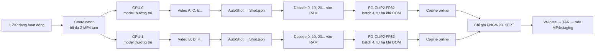

# AIC video pipeline V1

Đường chạy Kaggle tối ưu dùng hai GPU worker thường trú. Mỗi GPU nạp AutoShot
và FG-CLIP2 đúng một lần, sau đó nhận lần lượt nhiều video từ hàng đợi:



## Quy tắc xử lý

- Nhánh streaming lấy source index `0, 10, 20, ...` vào một hàng đợi RAM nhỏ.
- `embedding.batch_size` là số ảnh trong một lần inference FG-CLIP2, không phải
  khoảng cách lấy mẫu và không phải batch video.
- Tên file là source frame index dạng số nguyên: `0.png`, `10.png`, `20.png`
  và vector tương ứng là `0.npy`, `10.npy`, `20.npy`.
- Frame được mapping vào `shot_id`, embedding và so cosine ngay khi batch hoàn tất.
- Model embedding là `qihoo360/fg-clip2-large`, provider `fgclip2`.
- Trong mỗi shot, frame đầu tiên là `KEPT`. Các frame sau được so với
  representative `KEPT` gần nhất. Nếu cosine `>= similarity.threshold` thì là
  `DUPLICATE`; nếu thấp hơn thì frame đó trở thành representative mới.
- Representative được reset khi đổi shot.
- `DUPLICATE` bị bỏ ngay trong RAM; chỉ record, PNG và NPY `KEPT` được ghi xuống ổ.
- Hai tiến trình GPU dùng chung một bộ model trên disk nhưng giữ một model FP32
  riêng trên VRAM của mỗi GPU.

## Output

```text
data/
├── checkpoints/L21_V001.json
├── metadata/L21_V001/
│   ├── Shot.json
│   └── Frame.json
├── frames/L21_V001/
│   ├── 0.png
│   └── 20.png
└── vectors/L21_V001/
    ├── 0.npy
    └── 20.npy
```

CLI cũ giữ các stage materialized:

```text
EXTRACTED → MAPPED → EMBEDDING → EMBEDDED
→ SIMILARITY_CLASSIFIED → FINAL
```

Đường `--streaming` dùng `STREAMING → FINAL`; trường `progress` lưu source
frame cuối đã xử lý và các bộ đếm để tiếp tục sau khi bị ngắt.

Checkpoint riêng lưu các stage `shots_ready`, `frames_extracted`,
`frames_mapped`, `embeddings_ready`, `similarity_classified`, `deduplicated`
và `validated`. Nếu tiến trình bị ngắt, chạy lại đúng lệnh sẽ tiếp tục. Các NPY
hợp lệ đã có được dùng lại. Dùng `--fresh` khi thật sự muốn xóa output/checkpoint
của video đó và chạy lại từ đầu.

`Shot.json` giữ FPS, tổng frame, kích thước, codec và checksum của MP4. Vì vậy
output đã đóng gói vẫn validate được sau khi Kaggle xóa MP4 tạm.

## Chạy local

```bash
cd /home/long/Documents/AIC/BoldSearch/pipelines/aic_video_pipeline_v1

PYTHONPATH=src HF_HUB_OFFLINE=1 TRANSFORMERS_OFFLINE=1 \
/home/long/miniconda3/bin/python -m aic_video_pipeline_v1.cli run \
  --config configs/default.yaml \
  --video "/path/to/L21_V001.mp4" \
  --video-id L21_V001
```

Thêm `--streaming` để dùng đường chỉ ghi `KEPT`, batch trong RAM:

```bash
PYTHONPATH=src HF_HUB_OFFLINE=1 TRANSFORMERS_OFFLINE=1 \
/home/long/miniconda3/bin/python -m aic_video_pipeline_v1.cli run \
  --streaming \
  --config configs/default.yaml \
  --video "/path/to/L21_V001.mp4" \
  --video-id L21_V001
```

Chạy tiếp sau khi bị ngắt: dùng lại đúng lệnh, không thêm `--fresh`.

Validate:

```bash
PYTHONPATH=src /home/long/miniconda3/bin/python \
  -m aic_video_pipeline_v1.cli validate \
  --config configs/default.yaml \
  --video-id L21_V001
```

Test:

```bash
PYTHONPATH=src /home/long/miniconda3/bin/python -m pytest -q
```

## Chạy trên Kaggle với disk 19.5 GB

Có thể upload nguyên thư mục hoặc file `aic_video_pipeline_v1_kaggle.zip` thành
Kaggle Dataset. Bật GPU, sau đó chạy cell dưới đây; cell tự giải nén source nếu
input là ZIP:

```bash
%%bash
set -Eeuo pipefail

SOURCE_ROOT="/kaggle/working/aic_uploaded_source"
mkdir -p "$SOURCE_ROOT"

SETUP_SCRIPT="$(find /kaggle/input -type f \
  -path '*/aic_video_pipeline_v1/scripts/kaggle_setup_and_run.sh' \
  -print -quit)"

if [[ -z "$SETUP_SCRIPT" ]]; then
  SOURCE_ZIP="$(find /kaggle/input -type f \
    -name 'aic_video_pipeline_v1_kaggle.zip' -print -quit)"

  if [[ -z "$SOURCE_ZIP" ]]; then
    echo "Không tìm thấy source hoặc aic_video_pipeline_v1_kaggle.zip"
    exit 1
  fi

  unzip -q -o "$SOURCE_ZIP" -d "$SOURCE_ROOT"
  SETUP_SCRIPT="${SOURCE_ROOT}/aic_video_pipeline_v1/scripts/kaggle_setup_and_run.sh"
fi

if [[ ! -f "$SETUP_SCRIPT" ]]; then
  echo "Không tìm thấy kaggle_setup_and_run.sh sau khi giải nén"
  exit 1
fi

bash "$SETUP_SCRIPT"
```

Runner mặc định xử lý đúng các archive:

```text
Videos_L26_a.zip
Videos_L26_b.zip
Videos_L26_c.zip
Videos_L26_d.zip
Videos_L26_e.zip
```

Để dùng đủ hai GPU nhưng vẫn giới hạn disk, runner thực hiện:

```text
tải một ZIP có resume
→ tối đa hai MP4 tạm, một file cho mỗi GPU
→ hai GPU xử lý song song bằng model thường trú
→ frame đi qua RAM; chỉ ghi artifact KEPT
→ đóng gói output thành Lxx_Vxxx.tar
→ kiểm tra TAR
→ xóa MP4 và output đã materialize
→ hoàn tất mọi video trong ZIP thì xóa ZIP
```

Kết quả nằm tại:

```text
/kaggle/working/aic_pipeline_results/L21_V001.tar
/kaggle/working/aic_pipeline_results/L21_V002.tar
...
```

Nếu tiến trình bị ngắt hoặc Kaggle báo hết dung lượng, chạy lại cùng cell. ZIP
tải dở được `wget -c` tiếp tục; MP4 hiện tại và checkpoint pipeline được dùng
lại. Nếu thêm kết quả của version trước làm Kaggle Input, script tự nhận cả
file TAR nguyên bản lẫn thư mục `Lxx_Vxxx/` do Kaggle tự extract, rồi bỏ qua
video đã hoàn tất.

Khi chỉ còn output của session trước, thêm Dataset output đó làm Input. Chỉ TAR
cuối hợp lệ (`Lxx_Vxxx.tar`) hoặc thư mục TAR đã extract hợp lệ được bỏ qua;
file `.tar.tmp` và video không có output đầy đủ sẽ tự chạy lại. Để tránh đầy
disk, chạy từng ZIP qua biến `AIC_ARCHIVES`:

```bash
export AIC_ARCHIVES="Videos_L22_a.zip"
bash "$SETUP_SCRIPT"
```

Sau khi ZIP hoàn tất, Save Version, mở session mới, thêm output vừa lưu làm
Input rồi đổi sang ZIP tiếp theo. Bỏ `AIC_ARCHIVES` để dùng danh sách mặc định.

Chạy L26 a, b, c bằng cùng một wrapper. Để tránh đầy working disk, wrapper bắt
buộc mỗi Kaggle session chỉ chạy một part:

```bash
AIC_L26_PARTS="a" bash scripts/kaggle_run_l26_abc.sh
AIC_L26_PARTS="b" bash scripts/kaggle_run_l26_abc.sh
AIC_L26_PARTS="c" bash scripts/kaggle_run_l26_abc.sh
```

### Kaggle direct-input: L25 và L26

Hai bundle riêng đọc MP4 trực tiếp từ Dataset đã gắn, không tải ZIP video:

```text
aic_video_pipeline_l25.zip  -> Videos_L25_a/video/L25_V*.mp4
aic_video_pipeline_l26.zip  -> Videos_L26_a..e/video/L26_V*.mp4
```

L26 truyền nhiều video root vào một directory runner nên AutoShot và FG-CLIP2
chỉ được nạp một lần cho session. Mặc định cell L26 chạy đủ `a b c d e`; để
giới hạn part trong một Save Version, đặt ví dụ `AIC_L26_PARTS="d e"` trước khi
chạy nội dung `kaggle_cell_run_l26.txt`. Kết quả hợp lệ đã gắn làm Kaggle Input
sẽ được skip; TAR tạm hoặc lỗi sẽ được chạy lại.

Tạo hai source ZIP:

```bash
bash scripts/build_kaggle_level_bundles.sh --level 25
bash scripts/build_kaggle_level_bundles.sh --level 26
```

## Kaggle: video L27 đến L30

Danh sách archive video lấy từ Google Sheet được lưu tại
`configs/video_archives_l27_l30.tsv`. Không có Keyframes hay các file metadata
trong manifest này. L28, L29 và L30 dùng MP4 đã gắn trực tiếp vào Kaggle Input,
không tải ZIP video: mỗi script quét tuần tự `Lxx_V*.mp4` trong
`Videos_Lxx_a/video`, nạp model một lần, đóng gói xong từng video thành TAR rồi
mới chạy video tiếp theo. L27 vẫn có thể chạy từ archive theo manifest.

Với đường dẫn Input hiện tại, chạy cell tương ứng
`scripts/kaggle_cell_run_l28.txt`, `kaggle_cell_run_l29.txt` hoặc
`kaggle_cell_run_l30.txt`. Nếu Kaggle gắn Dataset ở slug khác, cell tự tìm MP4;
cũng có thể ghi đè đường dẫn trước khi chạy:

```bash
AIC_VIDEO_ROOT="/kaggle/input/<dataset-slug>/Videos_L28_a/video" \
  bash scripts/kaggle_run_l28.sh
```

Kaggle offline hiện dùng trực tiếp hai thư mục Input đã gắn:

```text
/kaggle/input/datasets/quanglongl040305/croodd/aic_video_pipeline_v1
/kaggle/input/datasets/quanglongl040305/modelfortrainning/aic_l28_offline_models
```

Các cell direct-input gọi source đã sửa hoặc giải nén ZIP source nhỏ vào `/tmp`,
rồi đặt `AIC_OFFLINE_MODEL_ROOT` bằng thư mục model trên. Không giải nén hay sao
chép video. Bộ model vẫn có `autoshot/` và `fgclip2/`, được tạo tại máy local
bằng:

```bash
bash scripts/build_kaggle_offline_model_bundle.sh
```

Để dùng đường dẫn Kaggle khác, đặt `AIC_CODE_ROOT`,
`AIC_OFFLINE_MODEL_ROOT` hoặc `AIC_VIDEO_ROOT` trước khi chạy cell. Chế độ này
chặn hoàn toàn việc tải model từ mạng.

Chạy đúng một level trong mỗi session Kaggle:

```bash
AIC_LEVEL=27 bash scripts/kaggle_run_l27_l30.sh
AIC_LEVEL=28 bash scripts/kaggle_run_l27_l30.sh
AIC_LEVEL=29 bash scripts/kaggle_run_l27_l30.sh
AIC_LEVEL=30 bash scripts/kaggle_run_l27_l30.sh
```

Sau mỗi level: Save Version, thêm output thành Kaggle Input cho session kế tiếp.

Nếu không muốn đặt biến `AIC_LEVEL`, bốn wrapper độc lập tương ứng bốn ZIP là:

```bash
bash scripts/kaggle_run_l27.sh  # Videos_L27_a.zip
bash scripts/kaggle_run_l28.sh  # MP4 Input: Videos_L28_a/video/L28_V*.mp4
bash scripts/kaggle_run_l29.sh  # MP4 Input: Videos_L29_a/video/L29_V*.mp4
bash scripts/kaggle_run_l30.sh  # MP4 Input: Videos_L30_a/video/L30_V*.mp4
```

Mỗi level cũng được đóng gói thành ZIP source riêng. Các cell Kaggle có thể
copy trực tiếp sẽ tự giải nén ZIP Input tương ứng, hoặc dùng thư mục nếu Kaggle
đã tự extract. Chúng được lưu tại:
`scripts/kaggle_cell_run_l27.txt`, `scripts/kaggle_cell_run_l28.txt`,
`scripts/kaggle_cell_run_l29.txt`, và `scripts/kaggle_cell_run_l30.txt`.

Các ZIP source tối giản được tạo lại bằng:

```bash
bash scripts/build_kaggle_level_bundles.sh
# Chỉ tạo lại một ZIP sau khi đổi runner tương ứng:
bash scripts/build_kaggle_level_bundles.sh --level 29
bash scripts/build_kaggle_level_bundles.sh --level 30
```

Model, Hugging Face cache, source runtime, AutoShot, ZIP video và MP4 tạm đều
nằm dưới `/tmp/aic_video_pipeline_runtime`. Chỉ kết quả cuối nằm trong
`/kaggle/working/aic_pipeline_results`, nên Save Version không lưu kèm model.
